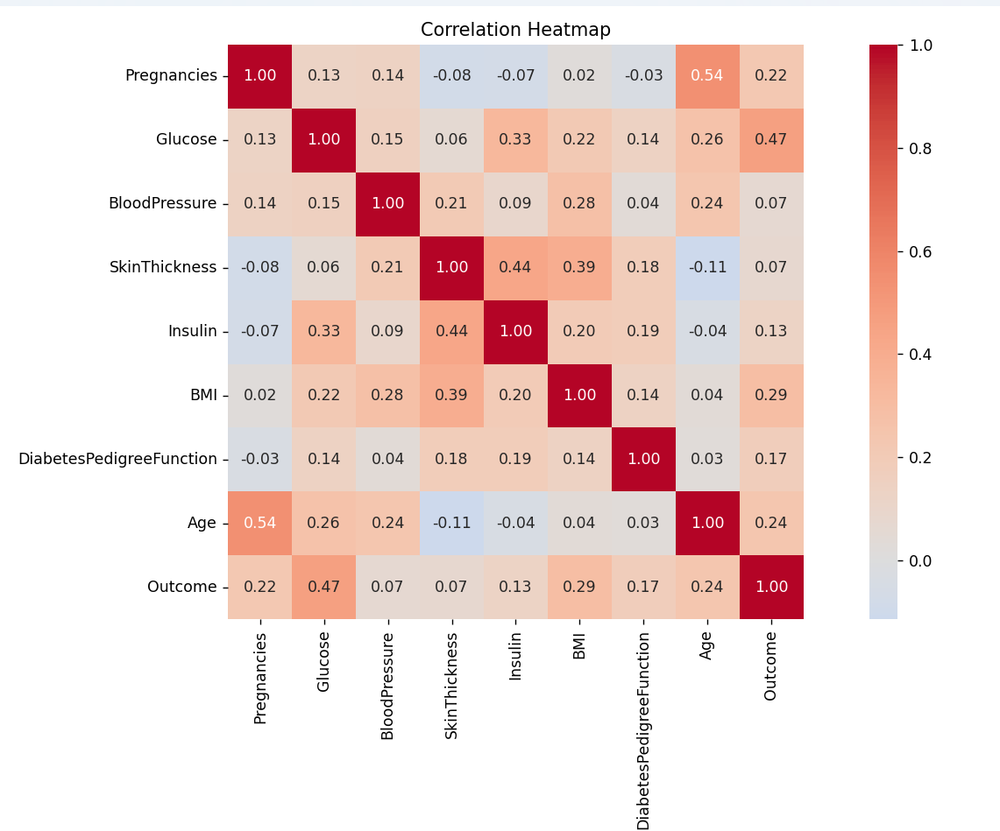
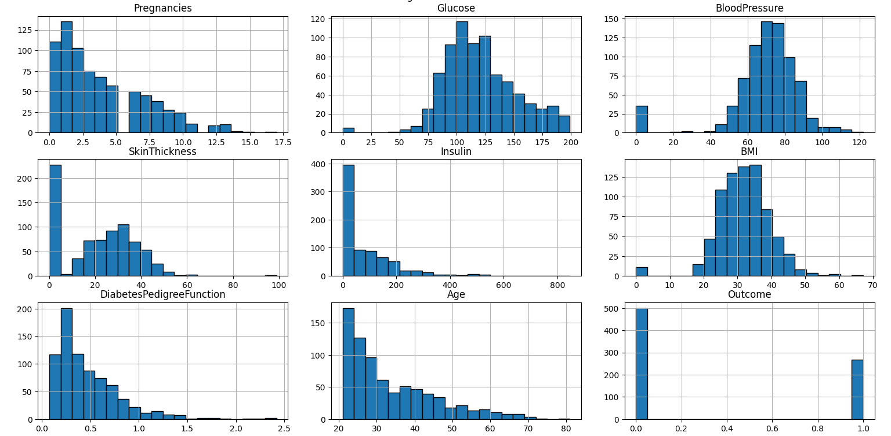
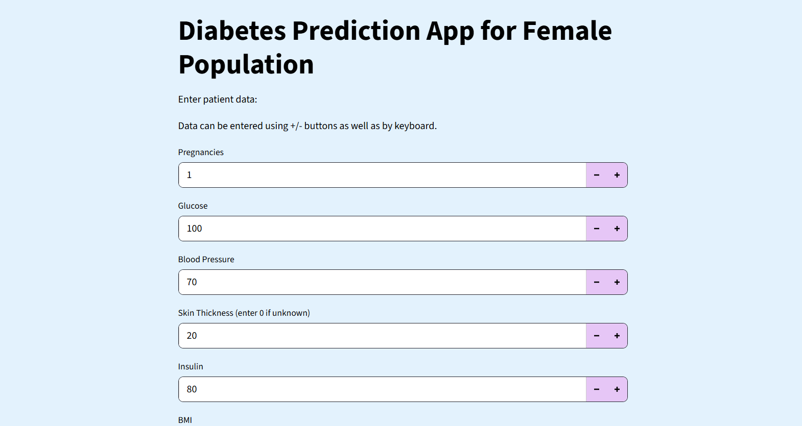

# Diabetes Predictor Web App

## Introduction
This repository contains the code files for a diabetes predictor web app hosted on Streamlit Cloud. This is a brief overview of the data, preprocessing steps, and the performance of different models that were tested.

---

## Data
The **Pima Indian Diabetes** dataset from Kaggle was used for training and evaluation of models.  
Since this dataset contains information only about female patients, the website is recommended **only** for predicting diabetes in female patients.

The dataset contains **8 features**:
- Pregnancies  
- Age  
- BMI  
- Blood Pressure  
- Skin Thickness (mm)  
- Diabetes Pedigree Function  
- Glucose  
- Insulin  

### Correlation Heatmap

### Feature Histograms

Several features have multiple instances with a value of **0**. Since it is medically impossible to have a 0 value for these, they represent missing information in the dataset. These were imputed using either **K-Nearest Neighbor** or **Median Imputation**, depending on the correlation between the missing features and others.

---

## Preprocessing
After analyzing the distributions of various features, the data was processed according to the capabilities and preferences of each tested model.

- **XGBoost**  
  - Missing values filled using KNN imputer.  
  - No scaling (XGBoost is robust to outliers).  

- **Logistic Regression**  
  - Missing values filled using KNN imputer.  
  - New features created by multiplying certain features.  
  - Outliers clipped.  
  - Data scaled using Robust Scaler.  

- **Neural Network**  
  - Missing values imputed with KNN.  
  - New features created using multiples and ratios of features.  
  - Outliers clipped.  
  - Data scaled using Standard Scaler.  

---

## Models
Three models were created and evaluated before choosing one for the web app:

- XGBoost  
- Logistic Regression  
- Neural Network  

The dataset was split into **80% training** and **20% test**.  
Hyperparameters for Logistic Regression and XGBoost were tuned using **GridSearchCV**.  

Since correctly identifying patients with diabetes is critical, more attention was given to the **recall value for class 1**.

### Model Performance

| Model               | Class | Precision | Recall | F1 Score | Overall Accuracy |
|---------------------|-------|-----------|--------|----------|------------------|
| **Neural Network**  | 0     | 0.87      | 0.76   | 0.81     | 0.77             |
|                     | 1     | 0.64      | 0.80   | 0.71     |                  |
| **Logistic Regression** | 0     | 0.87      | 0.65   | 0.74     | 0.71             |
|                     | 1     | 0.56      | 0.81   | 0.66     |                  |
| **XGBoost**         | 0     | 0.86      | 0.74   | 0.80     | 0.75             |
|                     | 1     | 0.62      | 0.78   | 0.69     |                  |

**Conclusion:**  
The Neural Network provided the best overall performance for this task.  
Although Logistic Regression achieved the best recall for class 1, it performed poorly in recall for class 0 and precision for class 1, which means more people could be incorrectly categorized as diabetic. Therefore, the Neural Network was chosen for deployment.

---

## Website
The web application was built using **Streamlit** and hosted on **Streamlit Community Cloud**.  

- Since typical patients may not know their **Diabetes Pedigree Function**, it is calculated through a short series of questions.  
- The **Skin Thickness** parameter is estimated using a Logistic Regression model with BMI, Blood Pressure, and Insulin as inputs, due to the high correlation between these features.

---
